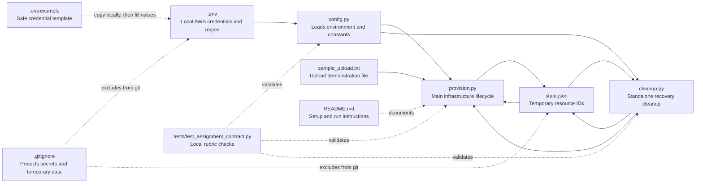
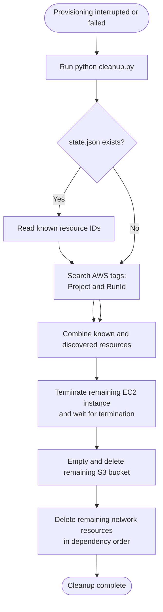

# Execution Flow - Week 7 Cloud Resource Manager

This document shows how the project provisions, demonstrates, and removes AWS
resources. GitHub renders the Mermaid blocks below as diagrams.

## Project File Connections



## Main Execution Flow

Run:

```powershell
python provision.py
```



```mermaid
flowchart TD
    START([Start provision.py])
    LOAD["config.py loads .env<br/>REGION, INSTANCE_TYPE, AMI_ID"]
    SESSION["Create boto3 Session<br/>EC2 client/resource, S3, SSM, STS"]
    SAVE["Generate RunId and save state.json"]
    VPC["Create VPC<br/>Enable DNS settings"]
    SUBNET["Create public subnet<br/>Enable public IPv4 assignment"]
    IGW["Create and attach<br/>internet gateway"]
    ROUTE["Create route table<br/>Add public route and association"]
    IP["Get public IP from api.ipify.org<br/>Convert to IP/32"]
    SG["Create security group<br/>Allow SSH port 22 only from IP/32"]
    AMI{"AMI_ID configured?"}
    PROVIDED["Use configured AMI ID"]
    SSM["Resolve latest Amazon Linux 2<br/>AMI from SSM or EC2 fallback"]
    EC2["Launch t2.micro EC2 instance<br/>in public subnet with security group"]
    RUNWAIT["Waiter: instance_running"]
    DISPLAY["Print instance ID<br/>and public IP"]
    BUCKET["Create unique S3 bucket<br/>with UUID suffix"]
    UPLOAD["Upload sample_upload.txt<br/>using put_object"]
    LIST["List bucket contents<br/>using list_objects_v2"]
    FINALLY["finally: Always start cleanup"]
    TERM["Terminate EC2 instance"]
    TERMWAIT["Waiter: instance_terminated"]
    EMPTY["Delete S3 objects, versions,<br/>and delete markers"]
    DELBUCKET["Delete S3 bucket"]
    NETWORK["Delete route association, route table,<br/>security group, gateway, subnet, VPC"]
    REMOVE["Remove state.json"]
    END([Complete: no assignment resources remain])

    START --> LOAD --> SAVE --> SESSION --> VPC --> SUBNET --> IGW --> ROUTE
    ROUTE --> IP --> SG --> AMI
    AMI -- Yes --> PROVIDED --> EC2
    AMI -- No --> SSM --> EC2
    EC2 --> RUNWAIT --> DISPLAY --> BUCKET --> UPLOAD --> LIST --> FINALLY
    FINALLY --> TERM --> TERMWAIT --> EMPTY --> DELBUCKET --> NETWORK --> REMOVE --> END
```

## Resources Created And Deleted

```mermaid
flowchart LR
    subgraph CREATE["Provision Phase"]
        direction TB
        C1["VPC"]
        C2["Public Subnet"]
        C3["Internet Gateway"]
        C4["Route Table + Association"]
        C5["Security Group"]
        C6["EC2 Instance + Root Volume"]
        C7["S3 Bucket"]
        C8["S3 Object"]
        C1 --> C2 --> C3 --> C4 --> C5 --> C6 --> C7 --> C8
    end

    subgraph DELETE["Cleanup Phase - Dependency-Safe Order"]
        direction TB
        D1["Terminate EC2 Instance<br/>Root Volume deleted with instance"]
        D2["Delete S3 Object / Versions"]
        D3["Delete S3 Bucket"]
        D4["Disassociate and Delete Route Table"]
        D5["Delete Security Group"]
        D6["Detach and Delete Internet Gateway"]
        D7["Delete Subnet"]
        D8["Delete VPC"]
        D1 --> D2 --> D3 --> D4 --> D5 --> D6 --> D7 --> D8
    end

    C8 -->|"finally block runs"| D1
```



## Failure Recovery Flow

If `provision.py` is interrupted or a cleanup API call fails, run:

```powershell
python cleanup.py
```



## Assignment Requirements Mapped To Code

| Assignment requirement | Where it is implemented |
| --- | --- |
| Create a VPC with a public subnet | `provision.py` - `create_vpc()` |
| Restrict SSH to current public IP | `get_current_ip()` and `create_security_group()` |
| Launch a `t2.micro` instance | `launch_instance()` with `INSTANCE_TYPE` from `config.py` |
| Wait until instance is running | `instance_running` waiter in `launch_instance()` |
| Print instance ID and public IP | `launch_instance()` after the running waiter |
| Create a unique S3 bucket | `create_bucket()` with a UUID suffix |
| Upload and list an object | `upload_and_list_objects()` |
| Terminate and wait for EC2 | `terminate_instance()` with `instance_terminated` waiter |
| Empty and delete S3 bucket | `delete_bucket_objects()` and `cleanup_bucket()` |
| Always clean up on failure | `try/finally` in `run_lifecycle()` |
| Recover after interruption | `state.json`, tags, and `cleanup.py` |
| Protect credentials | `.env`, `.env.example`, and `.gitignore` |
| Safely validate code | `tests/test_assignment_contract.py` |
